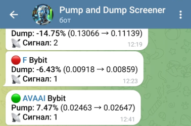

# PUMP-DUMP Telegram Listener

Скрипт парсит и записывает данные из [**Telegram-канала**](https://t.me/pump_scr).



## 📈 Обзор

Скрипт слушает последние сообщения, парсит и в случае
нахождения в сообщении метки 🟢 записывает в **Google-таблицу**.

Пример сообщения:

```text
🟢 SCRT Bybit
Pump: 6.5% (0.2169 → 0.231)
📡 Сигнал: 2
```

Запись идёт в первую ячейку таблицы с форматированием **НАИМЕНОВАНИЕ** + **USTD.P**:

|     | A          | B   |
| --- | ---------- | --- |
| 1   | SCRTUSDT.P | ... |
| 2   | ...        | ... |

## 🔧 Конфигурация

Для запуска бота нужно установить **API_ID** и **API_HASH**. Зарегистрировать **Telegram API** можно в [**личном кабинете Telegram**](https://my.telegram.org/apps).

```python
# Доступ к Telegram API telegram
# Подробнее https://my.telegram.org/apps
API_ID: int = 0
API_HASH: str = "..."
```

Для доступа к **Google Sheets** нужно зарегистрировать **Google Cloud API**. Подробнее в [**официальном гайде**](https://developers.google.com/workspace/sheets/api/quickstart/python?hl=ru).

Полученный файл с ключами необходимо переименовать в **credentials.json** и закинуть рядом с **main.py**.

```python
# Файл с ключами от Google API
# Подробнее https://developers.google.com/workspace/sheets/api/quickstart/python?hl=ru
CREDENTIALS_FILE = "credentials.json"
```

Так же необходимо создать и указать ссылку на **Google Sheets** таблицу.

```python
# Ссылка на Google Sheets таблицу
SPREADSHEET_URL = "..."
```

По умолчанию скрипт проверяет каждые 5 секунд новое сообщение
и держит новую запись в таблице 10 секунд, после чего стирает.

```python
# Задержка прослушивания канала (в секундах)
LISTEN_DELAY: int = 5
# Задержка перед удалением данных в таблице (в секундах)
CLEANUP_DELAY: int = 10
```

## 🔨 ЗАПУСК

Автоматический запуск скрипта:

```sh
source start.sh &
```

Остановить скрипт можно командой:

```sh
source stop.sh
```

Проверить работоспособность комадной:

```sh
source status.sh
```
